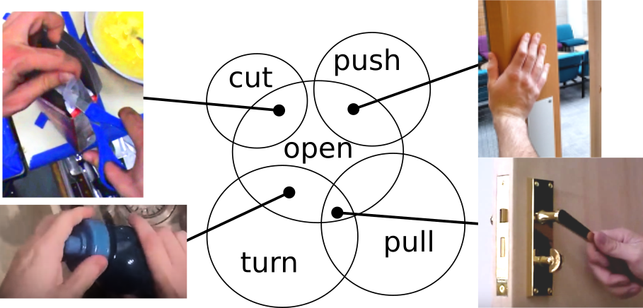

<link rel="shortcut icon" type="image/x-icon" href="favicon.ico">
<p align="center" style="font-size:30px">
<a href="https://mwray.github.io/">Michael Wray</a> and <a href="https://dimadamen.github.io/">Dima Damen</a>
</p>




## Abstract

This work introduces verb-only representations for both recognition and retrieval of visual actions, in video. Current methods neglect legitimate semantic ambiguities between verbs, instead choosing unambiguous subsets of verbs along with objects to disambiguate the actions. We instead propose multiple verb-only labels, which we learn through hard or soft assignment as a regression. This enables learning a much larger vocabulary of verbs, including contextual overlaps of these verbs.

We collect multi-verb annotations for three action video datasets and evaluate the verb-only labelling represen-tations for action recognition and cross-modal retrieval (video-to-text and text-to-video).We demonstrate that multi-label verb-only representations outperform conventional sin-gle verb labels. We also explore other benefits of a multi-verb representation includingcross-dataset retrieval and verb type (manner and result verb types) retrieval.


## Video


<style>
    .embed-container {
        position: relative;
        padding-bottom: 56.25%;
        height: 0;
        overflow: hidden;
        max-width: 100%;
    }
    .embed-container iframe,
    .embed-container object,
    .embed-container embed {
        position: absolute;
        top: 0;
        left: 0;
        width: 100%;
        height: 100%;
    }
</style>
<div class='embed-container'>
    <iframe src='https://www.youtube.com/embed/GEJRi5etiaE' frameborder='0'
allowfullscreen></iframe>
</div>


## Paper

[PDF](MVOL.pdf)

[ArXiv](https://arxiv.org/abs/1907.11117)

## Bibtex

```markdown
@InProceedings{wray2019learning,
    author    = {Wray, Michael and Damen, Dima},
    title     = {Learning Visual Actions Using Multiple Verb-Only Labels},
    booktitle = {British Machine Vision Conference (BMVC)},
    year      = {2019}
}
```

## Annotations

The annotations for the three datasets can be found [here](https://github.com/mwray/Multi-Verb-Labels).

## Acknowledgements
This research is supported by [EPSRC LOCATE (EP/N033779/1)](https://gow.epsrc.ukri.org/NGBOViewGrant.aspx?GrantRef=EP/N033779/1) and EPSRC Doctoral Training Partnerships (DTP). 
